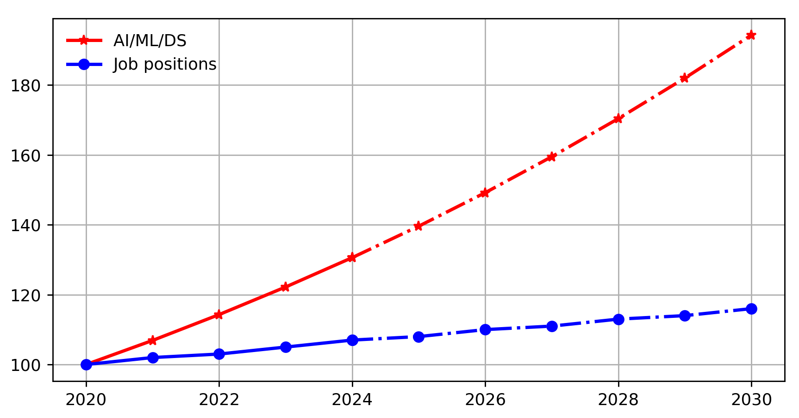
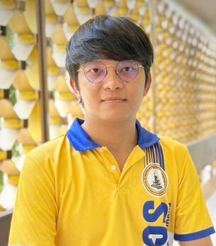

<!-- _class: titlepage -->

 Master of Science Program in COMPUTATIONAL SCIECNE

 โครงการพัฒนาหลักสูตรระดับบัณฑิตศึกษา 

 Department of Mathematics and Computer Science                               

 20 December 2024        

 Rajamangala University of Technology Thanyaburi    

---

<!-- ---------------------------- -->

# Numbers of Programs

| 
Department/Division
  | Bachelor Program | Master Program | PhD Program |
|:---------|:------:|:------:|:-------:|
| **Mathematics** | &#9989; | &#10060; | &#10060; |
| Applied Statistics      | &#9989; | &#9989; | &#10060; |
| Computer Science | &#9989; | &#9989; | &#10060; |
| Com.Tech./Big Data    | &#9989; | &#9989; | &#10060; |
| Chemistry   | &#9989; | &#9989; | &#9989; |
| Physics     | &#9989; | &#9989; | &#9989; |
| Biology     | &#9989; | &#9989; | &#9989; |
| Food Science  | &#9989; | &#10060; | &#10060; |

---

# Numbers of Students

| 
Department/Division
  | Bachelor Program | Master Program | PhD Program |
|:---------|:------:|:------:|:-------:|
| **Mathematics** | 71 | 0 | 0 |
| Applied Statistics      | 111 | 0 | 0 |
| Computer Science | 381 | 0 | 0 |
| Com.Tech./Big Data    | 385 | 3 | 0 |
| Chemistry   | 96 | 7 | 1 |
| Physics     | 82 | 4 | 3 |
| Biology     | 140 | 2 | 1 |
| Food Science  | 123 | 0 | 0 |

---

# Numbers of 5-Y Publications

| 
Department/Division
  | Scopus Q1 | Scopus Q2 | Scopus Q3 | Scopus Q4 | TCI | TOTAL |
|:---------|:------:|:------:|:-------:|:-------:|:-------:|:-------:|
| **Mathematics** | 38 | 22 | 10 | 12 | 10 | 92 |
| Applied Statistics      | 56 | 13 | 23 | 13 | 20 | 125 |
| Computer Science | 1 | 0 | 2 | 1 | 9 | 13 | 
| Com.Tech./Big Data    | 1 | 4 | 5 | 0 | 7 | 17 |
| Chemistry   | x | x | x | x | x | x |
| Physics     | x | x | x | x | x | x |
| Biology     | x | x | x | x | x | x |
| Food Science  | x | x | x | x | x | x |

---

# Projected Numbers of Job Positions

---

  

  
 

  

## **WEERAWAT SUDSUTAD**

- Ph.D. in Applied Mathematics;
- M.Sc. in Applied Mathematics;
- B.Sc. in Applied Mathematics;

#### Assistant Professor:

- Department of Statistics, Faculty of Science, Ramkhamhaeng University

#### Awards:

- 80+ Scopus Publications with 1000+ citations and `17 h-index`

---

  

  
 

  

## **THANAPONG INTHARAH**

- Ph.D. in Computer Science;
- M.Sc. in Machine Learning;
- B.Sc. in Mathematics;

#### Assistant Professor:

- Department of Statistics, Faculty of Science, Khon Kaen University

#### Awards:

- Outstanding Research Award,  National Research Council of Thailand (2024)

---

  

  
 

  

## **EKKAPONG BOONSEN**

- M.B.A. in Global Business;
- M.Sc. in Mathematics;
- B.Sc. in Mathematics;

#### Managing Director:

- Emerald Real Estate Co., Ltd.

#### Consultances:

- Pruksa Real Estate Public Co. Ltd.
- Chanunthorn Development Group Co., Ltd.

---

---

