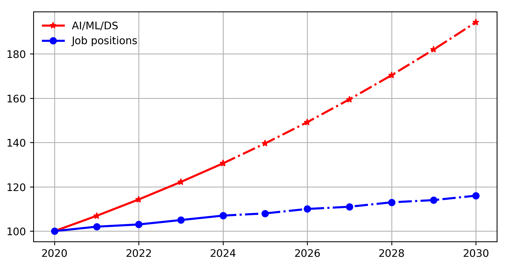

<!-- _class: titlepage -->

 Master of Science Program in APPLIED MACHINE LEARNING

 โครงการวิพากษ์หลักสูตรระดับบัณฑิตศึกษา 

 Department of Mathematics and Computer Science                               

 28 February 2025        

 Rajamangala University of Technology Thanyaburi    

---

<!-- ---------------------------- -->

# Numbers of Programs

| 
Department/Division
  | Bachelor Program | Master Program | PhD Program |
|:---------|:------:|:------:|:-------:|
| **Mathematics** | &#9989; | &#10060; | &#10060; |
| Applied Statistics      | &#9989; | &#9989; | &#10060; |
| Computer Science | &#9989; | &#9989; | &#10060; |
| Com.Tech./Big Data    | &#9989; | &#9989; | &#10060; |
| Chemistry   | &#9989; | &#9989; | &#9989; |
| Physics     | &#9989; | &#9989; | &#9989; |
| Biology     | &#9989; | &#9989; | &#9989; |
| Food Science  | &#9989; | &#10060; | &#10060; |

---

# Numbers of Students

| 
Department/Division
  | Bachelor Program | Master Program | PhD Program |
|:---------|:------:|:------:|:-------:|
| **Mathematics** | 71 | 0 | 0 |
| Applied Statistics      | 111 | 0 | 0 |
| Computer Science | 381 | 0 | 0 |
| Com.Tech./Big Data    | 385 | 3 | 0 |
| Chemistry   | 96 | 7 | 1 |
| Physics     | 82 | 4 | 3 |
| Biology     | 140 | 2 | 1 |
| Food Science  | 123 | 0 | 0 |

---

# Numbers of 5-Y Publications

| 
Department/Division
  | Scopus Q1 | Scopus Q2 | Scopus Q3 | Scopus Q4 | TCI | TOTAL |
|:---------|:------:|:------:|:-------:|:-------:|:-------:|:-------:|
| **Mathematics** | 38 | 22 | 10 | 12 | 10 | 92 |
| Applied Statistics      | 56 | 13 | 23 | 13 | 20 | 125 |
| Computer Science | 1 | 0 | 2 | 1 | 9 | 13 | 
| Com.Tech./Big Data    | 1 | 4 | 5 | 0 | 7 | 17 |
| Chemistry   | x | x | x | x | x | x |
| Physics     | x | x | x | x | x | x |
| Biology     | x | x | x | x | x | x |
| Food Science  | x | x | x | x | x | x |

---

# Projected Numbers of Job Positions

---

